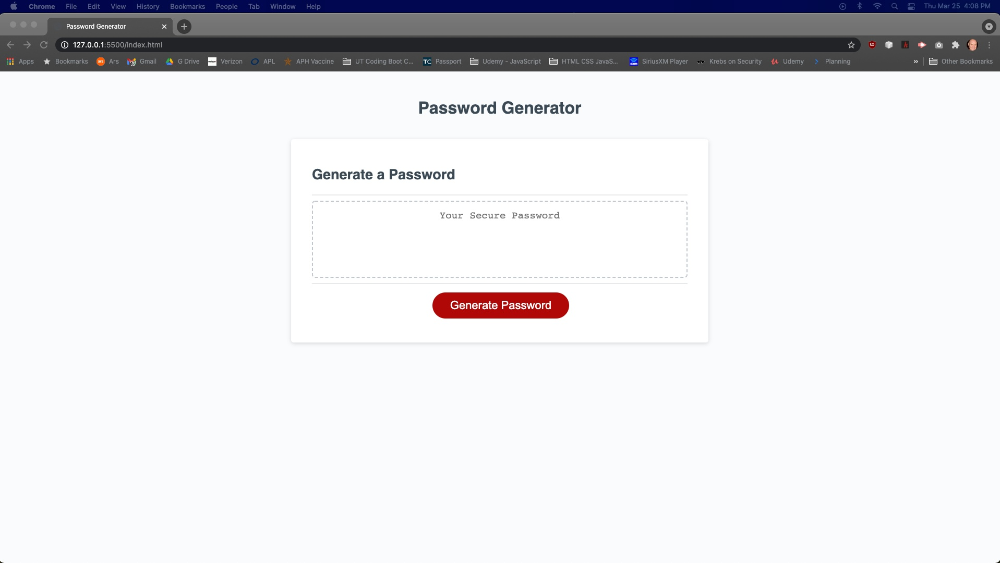
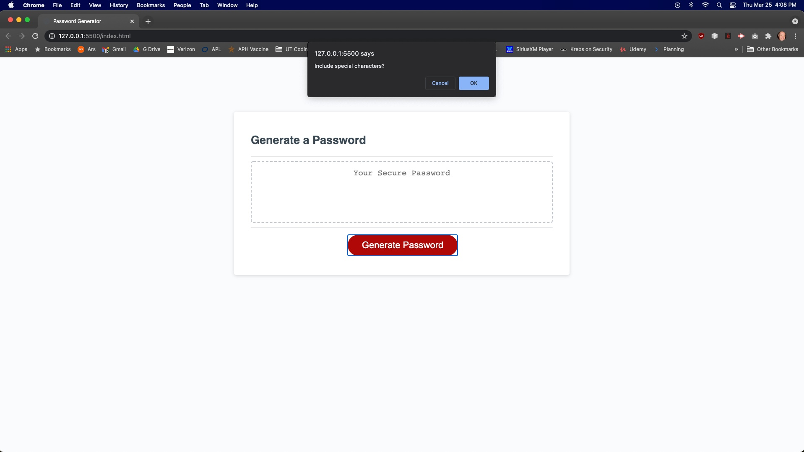

# password-generator

## Deployed Application
https://swillrich5.github.io/password-generator/

## GitHub
https://github.com/swillrich5/willrich-portfolio

## Description
password-generator fulfills the requirements of Homework 03 by completing the coding needed to generate a password taking into account the user's preferences.  The acceptance criteria include:

* Accept input from user by using the prompt, alert, and confirm JavaScript methods:

  * Password length between 8 and 128 characters
  * Optional characters sets to include - special characters, lowercase letters, uppercase letters, and numbers.  
  * At least one character set must be selected.

* Display of the generated password in an alert or displayed on the page.

## Psuedocode
```
User kicks off password generation by clicking button

Get User Input:
* Number of characters in password (between 0 and 128)
* Should special characters be included?
* Should lowercase letters be included?
* Should uppercase letters be included?
* Should numbers be included?

Generate string of characters to be used in password generation based on above user input

For the length of the password desired -
   * Pick a random character (Math.random function) 
   * Add random character to a string that holds the final password
   * Continue looping until desired length reached

Return generated password and display on screen
```

## Images

Initial Screen Appearance
   


Accepting Input


Generated Password


## Technologies Used

The application was developed using HTML, Cascading Style Sheets (CSS), and Javascript.

